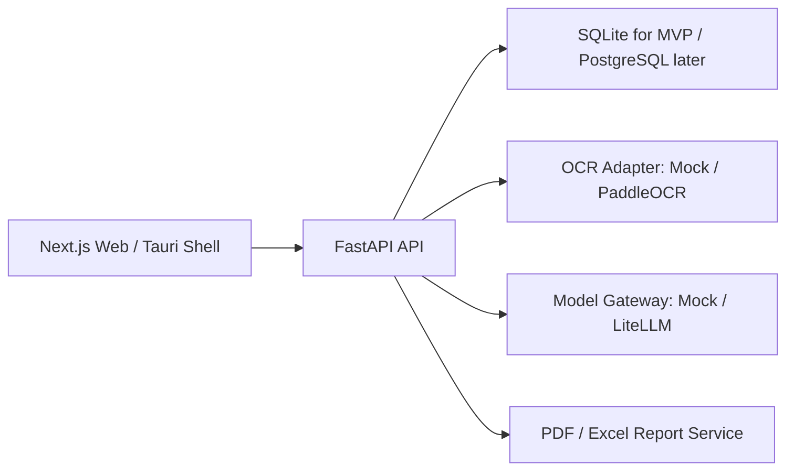

# v1 架构说明

## 设计目标

系统定位为“汇安检测”，不是单一食品标签审核工具。行业、标准、规则、报价、模型配置都由后台维护。

## 运行架构

## 审核链路

1. 用户上传图片或文件。
2. 后端保存文件并创建 `AuditTask`。
3. OCR 适配器输出文字、位置、置信度。
4. 字段抽取服务按行业字段模板生成结构化数据。
5. 规则引擎先执行确定性审核。
6. 模型路由器判断模型是否支持视觉：
   - 支持视觉：图片 + OCR 文本 + 规则上下文一起发送。
   - 不支持视觉：仅发送 OCR 后的结构化 JSON + 规则上下文。
7. 审核报告记录模型、规则、标准版本和人工复核状态。
8. 用户可从审核结果生成报价。

## 扩展点

- `OCR_PROVIDER=paddleocr`：切换到真实 PaddleOCR。
- `MODEL_PROVIDER=litellm`：切换到 LiteLLM 模型网关。
- `DATABASE_URL=postgresql+psycopg://...`：切换 PostgreSQL。
- Tauri 桌面端复用 Web 前端。

## 桌面端

`apps/desktop` 是 Tauri 2 的最小壳配置。开发时加载 `http://localhost:3000`，构建时读取 `apps/web/out`。若要正式打包，需要把 Next.js 前端切换为静态导出或让 Tauri 指向公司内网/云端 Web 地址。
